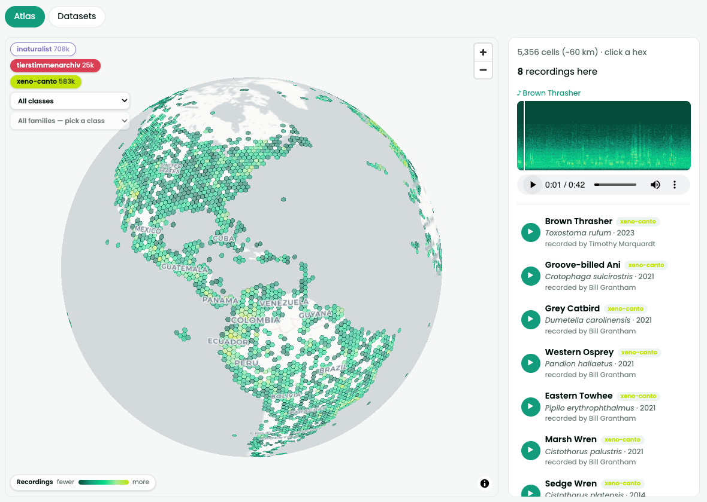

# alp-data Interactive Explorer

Browse a curated selection of `alp-data` datasets with rich metadata — species coverage, recording counts, licenses, and date ranges — with filters by audio type, location, species, and ecosystem. For select datasets, explore their geographic distribution on an interactive map.

<a href="http://alp-explorer.esp.dev/" class="ext-btn" target="_blank">Open Interactive Explorer</a>
